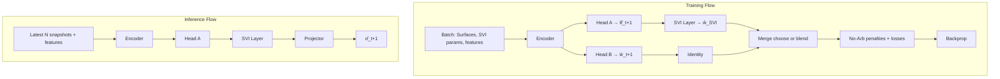

# Volatility Surface Forecasting Model — System & Dataflow Diagram
_Last updated: 2025-08-17 00:10:42_

This design aligns your **MLStockPredict** backtesting stack (GreeksEngine → Strategy → Execution) with an explicit **volatility-surface forecaster** for **next‑day** inference. It treats the surface as either (a) a **grid** over maturities × strikes or (b) a **parametric SVI surface**, with a shared **spatiotemporal Transformer/Informer encoder**.

---

## 1) High‑Level Pipeline (inputs → output)

```mermaid
flowchart LR
  A[Historical Surfaces<br/>S_t-N+1:t<br/>IV grid] --> B
  A2[Market State & Exogenous<br/>S_t, r_t, q_t, RV/VIX] --> B
  A3[Optional SVI Fits<br/>θ_t-N+1:t] --> B

  subgraph B[Input Processing]
    B1[Align maturities/strikes<br/>log-moneyness k=lnK/F]
    B2[Convert IV to total variance<br/>w=σ²T]
    B3[Mask & normalize<br/>handle missing grids]
    B4[Embed features<br/>positional encodings]
  end

  B --> C

  subgraph C[Spatiotemporal Encoder]
    C1[Temporal attention<br/>Transformer/Informer]
    C2[Cross-sectional attention<br/>across T,k slices]
    C3[Fusion + residuals]
  end

  C --> D1
  C --> D2

  subgraph D1[Head A: Parametric]
    H1[SVI Head → θ̂_t+1]
  end

  subgraph D2[Head B: Grid]
    H2[Grid Head → ŵ_t+1]
  end

  H1 --> E1
  H2 --> E2

  subgraph E1[SVI Layer]
    L1[Compute ŵ_SVI]
  end

  subgraph E2[Identity]
    L2[ŵ_Grid]
  end

  E1 --> F
  E2 --> F

  subgraph F[No-Arbitrage Projector]
    P1[Project to convex-in-K<br/>monotone-in-T]
  end

  F --> G[Output: Next-day Surface<br/>σ̂_t+1]

  classDef data fill:#eef7ff,stroke:#7aa6d8,color:#0b3050
  classDef proc fill:#fff7e6,stroke:#e0a546,color:#663c00
  classDef model fill:#e8ffe6,stroke:#60b25f,color:#114411
  classDef head fill:#f5e6ff,stroke:#9a73c7,color:#381e72
  classDef layer fill:#e6fbff,stroke:#53b7c2,color:#084a52
  classDef out fill:#f0fff0,stroke:#6fbf73,color:#104d12,font-weight:bold
  
  class A,A2,A3 data
  class B1,B2,B3,B4 proc
  class C1,C2,C3 model
  class H1,H2 head
  class L1,L2 layer
  class G out
```



**Input → Output contract:**  
- **Input:** `N` historical surfaces `σ_{t-N+1:t}(T,K)` + optional SVI params `θ_{t-N+1:t}`, features `(S_t, r_t, q_t, RV features, VIX, liquidity/microstructure)`  
- **Output:** one **next‑day** surface `σ̂_{t+1}(T,K)` (via SVI or direct grid)

---

## 2) Shapes & Data Schema

- Let maturities index `M` and strikes index `K` after alignment to a canonical grid (e.g., target expiries, target log‑moneyness points).  
- **Grids:** `σ` or `w` are tensors in `R^{N × M × K}`; masks in `R^{N × M × K}`.  
- **SVI params per maturity:** `θ = (a, b, ρ, m, σ)` in `R^{N × M × 5}`.  
- **Features:** concatenated per snapshot: `x_t ∈ R^{d}` (spot, rate, dividend yield, realized vol windowed stats, VIX, order-book/proxy liquidity, etc.).

---

## 3) Input Processing (deterministic)

- **Strike normalization:** `k = ln(K/F_t)` (with forward `F_t = S_t·e^{(r_t−q_t)T}`).  
- **IV→total variance:** `w = σ^2 · T` (stabilizes scale across maturities).  
- **Positional encodings:** continuous encodings for `T` and `k` (Fourier/time2vec).  
- **Masking:** retain observed (T,k) cells; apply masked attention and masked loss.  
- **(Optional) SVI prefit per snapshot:** robust fit `θ_{t-i}` per maturity to seed the parametric branch and provide a strong prior.

---

## 4) Spatiotemporal Encoder (Transformer/Informer)

- **Temporal attention:** learns dynamics across the `N` historical snapshots.  
- **Cross‑sectional attention:** learns local smile & term-structure patterns across `(T,k)`.  
- **Informer option:** replace full attention with **ProbSparse** attention for long `N` to scale to extended history.  
- **Fusion:** gated residual mixing between temporal/cross‑sectional streams; LayerNorm, dropout, and masking respected.

---

## 5) Output Heads

### Head A — SVI Parameter Forecast
Predicts next‑day `θ̂_{t+1}(T_m)` for each maturity `T_m`:
- **SVI (raw):** total variance smile
  ```
  w(k;θ) = a + b(ρ(k - m) + √((k - m)² + σ²))
  ```
- **Structural constraints (soft):** `b ≥ 0`, `|ρ| < 1`, `σ > 0`, and calendar consistency penalized across maturities.

### Head B — Grid Forecast (optional)
Directly outputs next‑day total variance grid `ŵ_{t+1}(T,k)`. Useful when you prefer a non‑parametric surface or when SVI fits are unstable for illiquid wings.

### SVI Layer (deterministic)
- Converts `θ̂_{t+1}` into a dense grid `ŵ^{SVI}(T,k)`; invert to IV: `σ̂ = √(ŵ/T)`.

### No‑Arbitrage Projector (optional)
- **Vertical (K) convexity:** discrete second‑derivative of call prices ≥ 0.  
- **Butterfly/calendar constraints:** penalize and/or project to a feasible set.  
- Can be implemented as a differentiable penalty during training and a post‑hoc convex‑projection at inference.

---

## 6) Losses & Regularization

Total training loss (mask-aware):
```
L = ||M ⊙ (ŵ - w_true)||²₂ (data term)
    + λ_noarb * L_noarb 
    + λ_temp * L_temporal 
    + λ_smooth * L_smooth
```

- **Data term:** MSE on total variance (or Huber), masked.  
- **No‑arbitrage:** convexity in K, monotonicity in T, calendar consistency (SVI constraints).  
- **Temporal consistency:** `||ŵ_{t+1} - Φ(w_t,...)||` w.r.t. a simple baseline (e.g., carry-forward + drift).  
- **Smoothness:** Tikhonov/TV on `θ̂` across maturities and on wings in `k`.  
- **Bid‑ask clipping:** penalize forecasts that breach mid ± half‑spread where available.

---

## 7) Training & Inference Flows



**Blend policy:** choose SVI branch by default for stability; fall back or blend with grid head in sparse regions.

---

## 8) Integration Points with MLStockPredict

- **ModelServer API (new):**
  - `get_surface(ticker, date, grid_spec) → σ̂(T,K)`
  - `get_implied_vol(ticker, date, T, K) → σ̂(T,K)`
  - `get_svi_params(ticker, date) → θ̂`
- **GreeksEngine:**
  - Accept IV from ModelServer; compute prices/Greeks (QuantLib or BS).  
- **Strategy/Backtest:**
  - Use σ̂_{t+1} to select contracts and hedge (delta / delta‑gamma).  
  - Log forecast vs realized IV for diagnostics.  
- **DataHandler additions:**
  - Canonical `(T,k)` grid builder; snapshot alignment; mask construction; optional SVI prefit per snapshot.
- **Evaluation hooks:**
  - Surface RMSE on IV/TV; no‑arb violation count; pricing error on listed options; hedge PnL attribution by forecast error.

---

## 9) Configuration Switches

- **`use_svi_head`** (default **true**) / `use_grid_head` (optional).  
- **`informer_mode`** for long histories.  
- **`loss_weights`**: `{data, noarb, temporal, smooth}`.  
- **`grid_spec`**: maturities and log‑moneyness knots.  
- **`features`**: include/exclude RV, VIX, rates, dividends, liquidity.

---

## 10) Minimal Pseudocode (training loop)

```python
batch = sampler.next()  # {surfaces: N×M×K, svi_params: N×M×5, features: N×d, mask: N×M×K}
x = preprocess(batch)   # align, k=ln(K/F), w=σ² T, encodings, masking

h = encoder(x.surfaces, x.features, mask=x.mask)   # spatiotemporal attention
theta_hat = svi_head(h)                            # M×5
w_grid_hat = grid_head(h) if use_grid_head else None

w_svi_hat = svi_layer(theta_hat, grid_spec)        # M×K
w_hat = blend(w_svi_hat, w_grid_hat, policy="svi_preferred")

loss = data_loss(w_hat, x.w_true, mask=x.mask) \
     + lambda_noarb * noarb_penalty(w_hat) \
     + lambda_temp  * temporal_penalty(x.history) \
     + lambda_smooth* smoothness(theta_hat, across="maturities")

loss.backward(); optimizer.step()
```

---

## 11) Notes & Practicalities

- **Missing data**: rely on masking; avoid imputing extremes.  
- **SVI stability**: regularize `θ` and initialize near previous day fit.  
- **Scaling**: prefer total variance; standardize per-maturity.  
- **Validation**: include pricing error on OTM options; monitor no‑arb metrics.  
- **Ablations**: (a) SVI vs grid head; (b) temporal window `N`; (c) feature subsets.  
- **Deployment**: cache latest SVI fit, warm‑start with prior `θ̂` at market open, refresh intraday if needed.

---

## 12) Deliverables

- This markdown + Mermaid diagrams (architecture & training/inference).  
- A simple `ModelServer` with endpoints above.  
- Unit tests for: preprocessing, SVI layer, projector, and encoder masking.